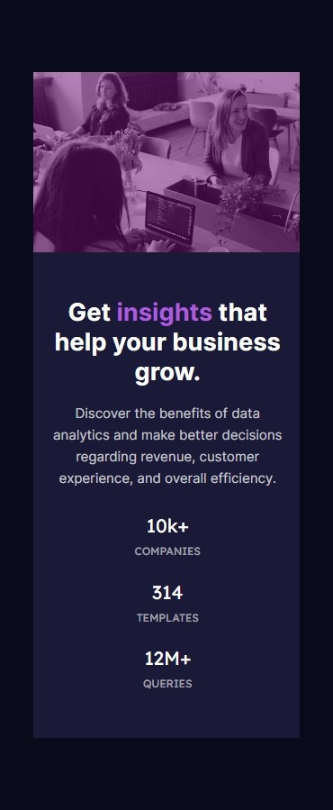

# Frontend Mentor - Stats preview card component solution

This is a solution to the [Stats preview card component challenge on Frontend Mentor](https://www.frontendmentor.io/challenges/stats-preview-card-component-8JqbgoU62).

## Table of contents

- [Overview](#overview)
- [The challenge](#the-challenge)
- [Screenshot](#screenshot)
- [Links](#links)
- [My process](#my-process)
- [Built with](#built-with)
- [Author](#author)

## Overview

This code creates a responsive Stats Preview Card Component. It features business insights and statistics, styled with CSS and Google Fonts for an appealing design.

### The challenge

Users should be able to:

- View the optimal layout depending on their device's screen size

### Screenshot

### Links

- Solution URL: [https://github.com/SONALI-NEGI/stats-preview-card-component-solution.git]
- Live Site URL: [Add live site URL here](https://your-live-site-url.com)

## My process

1. I Begin by thoroughly understanding the project requirements. This includes identifying key features, functionalities, and design guidelines provided.

2. Created a detailed plan for the project.

3. Started by building the basic HTML structure.

4. Added style.css file and applied styles as mentioned in the challenge.

5. Thoroughly tested the project on different devices and browsers to ensure compatibility.

6. Pushed my code on GitHub using git commands.

### Built with

- Semantic HTML5 markup
- CSS custom properties
- Flexbox
- Mobile-first workflow
- [Inter](https://fonts.google.com/specimen/Inter) - google font
- [Lexend Deca](https://nextjs.org/) - Google Font

## Author

- GitHub - [@SONALI-NEGI](https://github.com/SONALI-NEGI)
- Frontend Mentor - [@SONALI-NEGI](https://www.frontendmentor.io/profile/SONALI-NEGI)
- LinkedIn - [Sonali Negi](https://www.linkedin.com/in/negisonali/)
